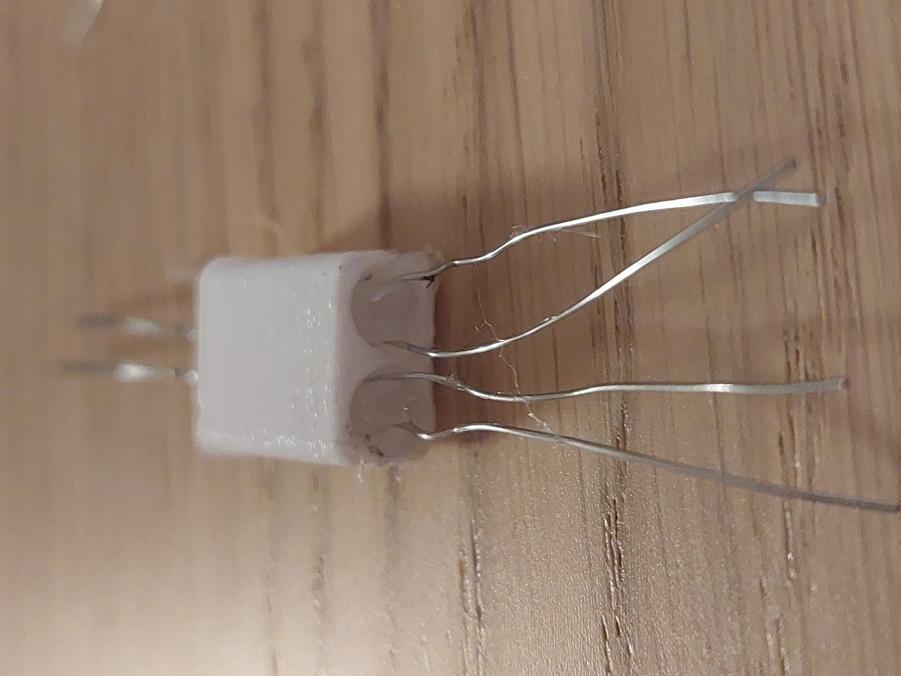
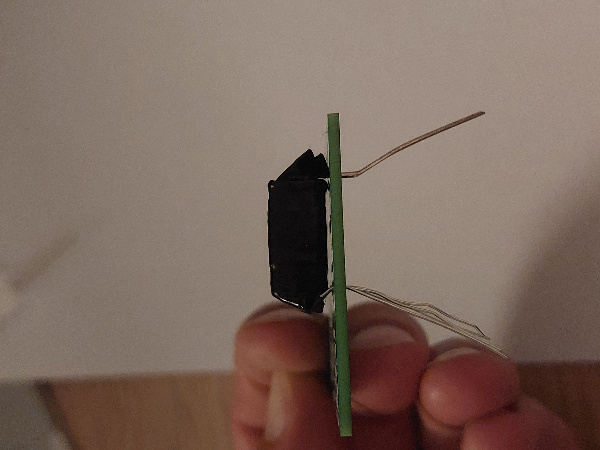
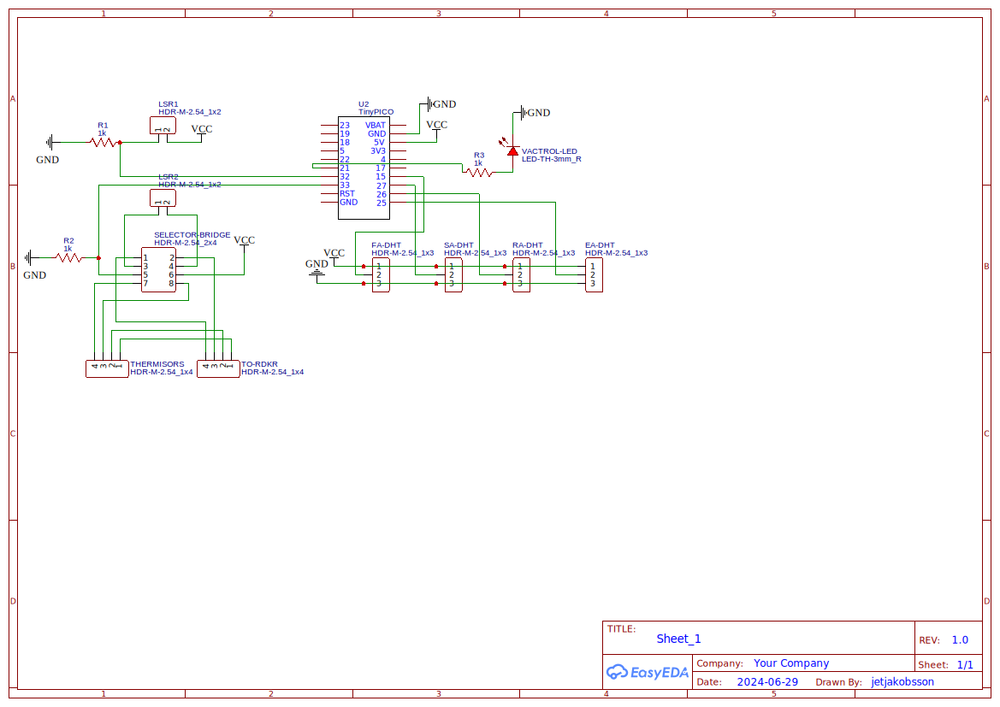
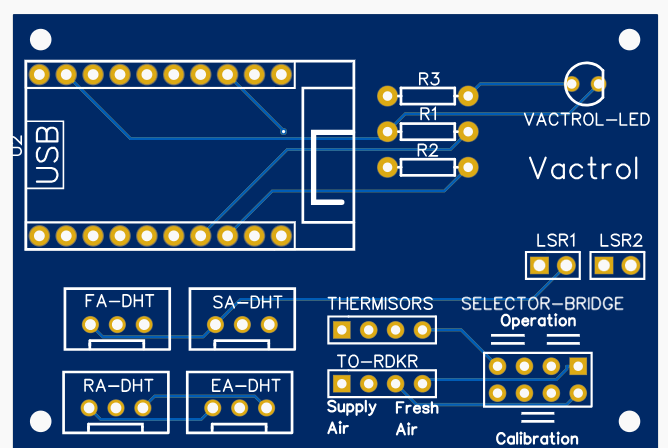

# Fläktwoods RDKR controller
The Fläktwoods RDKR rotating heat exchanger is an efficient system, and works very well in almost all situations. However, during warm summar days (above 25C) the system will not run the rotating heat exchanger as it stops between 15C and 20C depending on settings. This funnel the fresh air directly in to the supply air ducts, heating up the house.

## Solution
This RDKR controller aims to control the rotating heat exchanger to optimize the supply air temperature to maintain the aim temperature of the house.

The RDKR makes sure that the rotor is off when temperature is above the cut of temperature "börvärde" that you can set on the RDKR by turning the potensiometer. We take advantage of this to turn the rotor on and off by mimiking the fresh air thermistor.  

### Features
1. Compare the fresh air temperature with the return air temperature to shift the indoor temperature towards the aim temperature
2. Allow safe prolonged night cooling of the house to remove excess heat build up by calculating the dew point of the return air and starting the rotor when the fresh air temperature gets close to the dew point. This prevents condesation on the supply air ducts and water damage of the house.

## Method and material
### Microcontroller
The core of the RDKR controller is an ESP32 board called [TinyPICO](https://www.tinypico.com/). I have not tested any other esp32 boards, but I expect many of them to work as the code only use standar micropython librares.

### Temperature and humidity
To measure temperature and humidity, we will need 4 [DHT22 modules](https://www.amazon.com/HiLetgo-Temperature-Humidity-Electronic-Practice/dp/B0795F19W6/ref=sr_1_1_sspa?dib=eyJ2IjoiMSJ9.lL6dvViaA6cmFqgObjaog33xvnXysNAi8aZzhkrAPQtxaga36zggQUa30IlH1lTK_EcrYI8snq931u9ejeC9TippgFcyZpKDY7uPcrLRo48WBM2oU8X3UKpDX5VS0spX1bANi0XGpi1njNZ-8bMlR6TVooVcNa6eJ667SaMvMZqRCXyhFvu030Iwh_gK0sxApqC8YdgpH9qqaCnZVDiBu97zEFh-5VmG7VqKucxaBJo.rP1uZoxulgevSXPBJhsO7umReoTGEqONU54qa0Gt7u8&dib_tag=se&keywords=dht22&qid=1718041622&sr=8-1-spons&sp_csd=d2lkZ2V0TmFtZT1zcF9hdGY&th=1). Select the version called "module" and not the "sensor", as the module is basically plug and play.

### Controlling resistance (feedback vactrol)
To control the resistance that the RDKR measures with its fresh air thermistor pins, we will utilize an optoresistor, or Vactrol. We will construct this component our self using 1 led and two light sensitive resistors (LSRs). One LSR will be used as feedback to the LED contol, and the other will be connected to the RDKR. 

#### Build
A 3d model of the [feedback vactrol](https://cad.onshape.com/documents/d5db8724f7444de833602895/w/5097aa9532875356a5bfe0b9/e/74707de9a877e431fe2569b8?renderMode=0&uiState=66673e9433603938000e96be) can be found on my Onshape and downloaded for printing. I currently do not have the exact component list of what LED and what LSRs that I use, as these are components that I had at hand. If you copy this build, please comment what components that worked for you to make it more reproducible. 

| |  |
|------------------------|------------------------|

#### Calibration
No LSR is exacly the same, and the light that hits them from the LED is not uniform. To deal with this, we perform a calibration by sweeping through all LED intensities (PWM) and meassureing the resistance (Ohm) of the LSRs at each intencity. The PWM <-> Ohm relationship is not linear, however, the log(PWM) <-> log(Ohm) is perfectly linear allowing us to perform a linear regression. The slope and intercept coeficients can be used to describe the LSRs very precicly, and hence we can calculate what resistance the feedback LSR should have to produce the correct resistance of the output LSR. This is all done by the ESP32 during setup.

### Measuring resistance
We would like to provide the correct resistance to the RDKR most of the time, and to do this we will have to measure the resistance of the fresh air thermistor. One resistance measuring unit use one of the ADC pins and a voltage divider with a reference resistor of 1kOhm. Since we have to calibrate the feedback vactrol, the controller have two resitance measuring units.

## Circuit
This is the circuit diagram, and the open source easyeda project can be found [here](https://oshwlab.com/jetjakobsson/rdkr-controller) if you need to modify it to fit with your components.

Use the gerber file under resources to order your own PCBs.

## Usage
### Setup
1. Begin by adding your wifi credentials to the config.json file under src/.
2. Prepare your board with micropython 1.22.2 acording to your boards instructions.
3. Load all files under src/ to the microcontroller using Thonny, and restart the board.
4. Make sure the resistance measure units are connected to the feedback vactrol (channnel 1 to feedback and channel 2 to output)
5. in the REPL, write `import webrepl_setup`. This will allow you to set a password and access the board over wifi.
6. In the repl (or webrepl), write `vac.calibrate()`. This will run the calibration sweep and linear regression to update the coeficients.
7. If calibration was successful, run `vac.save_calibration()` to store the coeficients. These will be used at future startups.
8. Start the controller by running `start(set_temp=<your prefered indoor temperature>)`.
   
### data access
All sensors are acceable as MQTT sensors and can be incorporated in home assistant or other MQTT systems. This is the recomended way to log the reading, as the microcontroller does not have much memory.

